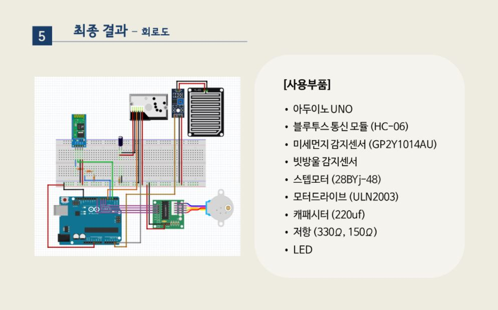

# Capstone-design
Capstone-design (2021-1,2)
   

</img>

### PIN
> - Dust out => A5
> - Dust led => D2
> - Rain => A4
> - Bluetooth TXD => D3
> - Bluetooth RXD => D4
> - Motor IN1,2,3,4 -> D8,D9,D10,D11

### Progress
> + 210712 : Arduino IDE , 센서 측정 부분 코딩
> + 210713 : 일정 시간동안 측정하여 평균, state 변경 / State 변화에 따른 동작
> + 210719 : 부품신청 (prof.HSH)
> + 210726 : 스텝모터 (24BYJ-48) datasheet -> 회전
> + 210809 : 코드 정리 (부품 신청 답장 아직 안 온 상태)
> + 210823 : 부품 주문 및 도착중 (모두 다 오면 수령예정)
> + 210824 : rain 센서 개별 동작 코드 (동작확인*)
> + 210909 : 부품 수령 (일부 부품 미도착), 일정 확인 // 모임
> + 210914 : dust 센서, motor 개별 동작 코드 // 모임
> + 211002 : BT 모듈 (Phone <-> Arduino) 통신 코드 작성
> + 211004 : 코드 정리 및 BT 연결 (BT 코드 수정 필요), 회로 연결 및 본체 제작 // 모임
> + 211005 : 본체 사포질 + 본체 케이스 수치 및 절단 + 레일 구상 // 모임
> + 211014 : 부품 일부 수령 및 레일 제작, 필름 나오는 위치 정해서 레일에 표시
> + 211031 : 스텝모터 동작 추가 //내일 학교가서 부품가지고 동작 + 블루투스
> + 211104 : 

###
- 스텝모터 대체 부품 : A4988 . 12V 전원 (https://blog.naver.com/mapes_khkim/221884318336)
- 
